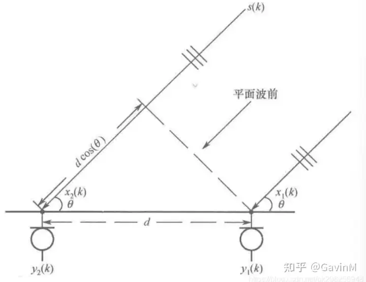

# 互相关函数（Cross-Correlation Function）
互相关函数峰值位置对应麦克风相对时延的原理，基于声波传播模型和信号处理理论。以下是详细解释：

### 1. **信号模型**
假设声源信号为 \( s(k) \)，两个麦克风接收的信号为：
\[
\begin{aligned}
y_1(k) &= \alpha_1 s(k - t_1) + v_1(k) \\
y_2(k) &= \alpha_2 s(k - t_2) + v_2(k)
\end{aligned}
\]
其中：
- \( \alpha_1, \alpha_2 \) 是衰减系数
- \( t_1, t_2 \) 是信号到达两个麦克风的时间
- \( \tau = t_2 - t_1 \) 即为相对时延（关键参数）
- \( v_1(k), v_2(k) \) 是不相关噪声

---

### 2. **互相关函数的本质**
互相关函数 \( r_{y_1,y_2}(p) \) 量化两个信号在时移 \( p \) 下的相似性：
\[
r_{y_1,y_2}(p) = E[y_1(k) \cdot y_2(k + p)]
\]

代入信号模型后展开,

\[
r_{y_1,y_2}(p) = E\left[ 
\underbrace{(\alpha_1 s(k - t_1) + v_1(k))}_{y_1(k)} \cdot 
\underbrace{(\alpha_2 s(k + p - t_2) + v_2(k + p))}_{y_2(k+p)}
\right]
\]

\[
\begin{aligned}
r_{y_1,y_2}(p) = E\bigg[ 
& \alpha_1\alpha_2 \cdot s(k - t_1) \cdot s(k + p - t_2) \\
& + \alpha_1 \cdot s(k - t_1) \cdot v_2(k + p) \\
& + \alpha_2 \cdot s(k + p - t_2) \cdot v_1(k) \\
& + v_1(k) \cdot v_2(k + p) 
\bigg]
\end{aligned}
\]

应用期望的线性性质,
\[
\begin{aligned}
r_{y_1,y_2}(p) = 
& \alpha_1\alpha_2 \cdot E\left[ s(k - t_1) \cdot s(k + p - t_2) \right] \\
& + \alpha_1 \cdot E\left[ s(k - t_1) \cdot v_2(k + p) \right] \\
& + \alpha_2 \cdot E\left[ s(k + p - t_2) \cdot v_1(k) \right] \\
& + E\left[ v_1(k) \cdot v_2(k + p) \right]
\end{aligned}
\]

假设：
1. 信号与噪声不相关：
   \[
   E\left[ s(\cdot) v_i(\cdot) \right] = 0 \quad (i=1,2)
   \]
2. 噪声间互不相关：
   \[
   E\left[ v_1(k) v_2(k + p) \right] = 0 \quad \forall p
   \]

后三项为零：
\[
\begin{aligned}
r_{y_1,y_2}(p) &= \alpha_1\alpha_2 E\left[ s(k - t_1)s(k + p - t_2) \right] + 0 + 0 + 0 \\
&= \alpha_1\alpha_2 \cdot r_{ss}(p - (t_2 - t_1))
\end{aligned}
\]

代入相对时延 \(\tau = t_2 - t_1\)
\[
\boxed{r_{y_1,y_2}(p) = \alpha_1\alpha_2 \cdot r_{ss}(p - \tau)}
\]

---

### 3. **峰值位置的物理意义**
\[
r_{y_1,y_2}(p) = \alpha_1\alpha_2 \cdot \underbrace{r_{ss}(p - \tau)}_{\text{信号自相关函数}}
\]
- **峰值位置**：当 \( p = \tau \) 时，\( r_{ss}(0) \) 达到最大值（信号自相关在零时移时最大）。
- **相对时延**：峰值对应的 \( p \) 值即为 \( \tau = t_2 - t_1 \)。

#### 3.1 自相关函数零时移时最大的数学证明
信号 \( s(k) \) 的自相关函数定义为：
\[
r_{ss}(m) = E\left[ s(k) \cdot s(k + m) \right]
\]
其中 \( m \) 是时移量（滞后时间）。对于确定性信号，若为能量信号，则定义为：
\[
r_{ss}(m) = \sum_{k=-\infty}^{\infty} s(k) \cdot s(k + m)
\]

对于任意信号 \( s(k) \)，由柯西-施瓦茨不等式（Cauchy-Schwarz Inequality）有：
\[
\left| \sum_k s(k) \cdot s(k + m) \right|^2 \leq \left( \sum_k |s(k)|^2 \right) \left( \sum_k |s(k + m)|^2 \right)
\]
- 右边：\( \sum_k |s(k)|^2 = r_{ss}(0) \)（信号的总能量）
- 左边：\( |r_{ss}(m)|^2 \)
  
因此：
\[
|r_{ss}(m)|^2 \leq \left[ r_{ss}(0) \right]^2
\]
即：
\[
\boxed{|r_{ss}(m)| \leq r_{ss}(0) \quad \text{对所有 } m}
\]
**当且仅当  \( m=0 \) 时，等号成立。**

#### 3.2 **图形化示例**
考虑一个简单的信号 \( s = [3, 1, -2] \)：
| 时移 \( m \) | 计算过程                     | \( r_{ss}(m) \) |
|------------|-----------------------------|----------------|
| \( m=0 \)  | \( 3×3 + 1×1 + (-2)×(-2) \) | \( 9+1+4=14 \) |
| \( m=1 \)  | \( 3×1 + 1×(-2) \)          | \( 3-2=1 \)    |
| \( m=-1\) | \( 1×3 + (-2)×1 \)          | \( 3-2=1 \)    |
| \( m=2 \)  | \( 3×(-2) \)                | \(-6\)         |

- **最大值**：\( r_{ss}(0) = 14 \)（零时移）
- 其他时移值均小于 14
---

### 4. **几何解释**

- **相对时延 \( \tau \) 的本质**：  
  是声波到达两个麦克风的时间差，由声源位置和麦克风间距决定。
  \[
  \tau = \frac{d \cdot \cos\theta}{c}
  \]
  其中 \( d \) 为麦克风间距，\( \theta \) 为声源方位角，\( c \) 为声速。

- **互相关峰值**：  
  对应两个麦克风信号对齐的最佳时移量，此时信号波形匹配度最高。
---

### 总结
互相关函数峰值位置 \( \hat{\tau}^{CC} = \underset{p}{\operatorname{argmax}}  r_{y_1,y_2}(p) \) 直接对应相对时延 \( \tau \)，其核心原理是：
1. 信号分量在 \( p = \tau \) 时完全对齐
2. 噪声分量在统计假设下被抑制
3. 信号自相关函数在零时移处取最大值

