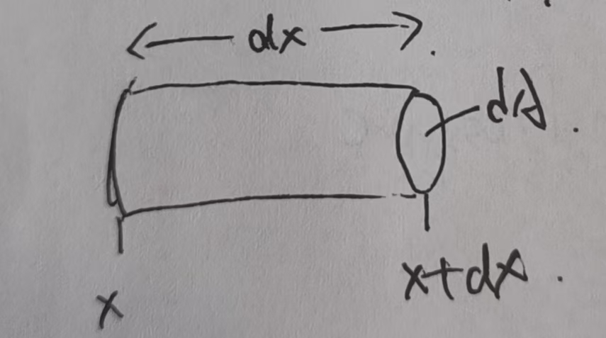

# Wave Function
## One Dimentional Wave Equation
### Notation
- $p(x,t)$:pressure
- $u(x,t)$:velocity
- $P_T = P_0 + P$, Total Pressure
- $V_T = V_0 +  \tau$: Total Volume
- $\rho_T = \rho_0 + \rho$: Total Density

### Model

Mass is Constant
$ \rho_0 V_0 = \rho_T V_T $ 

### Newton's 2nd Law
$ -[P(x+dx) - P(x)] dA = \frac{d}{dt}(Mu) = \rho_0 V_0 \frac{du}{dt} $

$ -[P(x+dx) - P(x)] dA = -\frac{[P(x+dx) - P(x)]}{dx} dAdx$

$ \Rightarrow 1.\frac{\partial P}{\partial x} = -\frac{\rho_0 V_0}{V_T} \frac{\partial u}{\partial t} \approx -\rho_0 \frac{\partial u}{\partial t} $

### The Gas Law
$P_{T} V_{T}^{\gamma} = \text{constant}$

$dP_{T} \cdot V_{T}^{\gamma} + P_{T} \gamma \cdot V_{T}^{\gamma-1} dV_{T} = 0$

$dP_{T} = -\frac{P_{T} \gamma}{V_{T}} dV_{T}$

$dP = -\frac{P_{0} \gamma}{V_{0}} d\tau$

$\Rightarrow 2.\frac{\partial P}{\partial t} = -\frac{P_{0} \gamma}{V_{0}} \frac{d\tau}{dt}$

### Continue Equation
$[u(x + dx) - u(x)] dA dt = dV_T = d\tau$

$\Rightarrow 3.\frac{\partial u}{\partial x} = \frac{1}{V_0} \frac{d\tau}{dt}$

eq2 + eq3

$\Rightarrow \frac{\partial P}{\partial t} = -P_0 \gamma \frac{\partial u}{\partial x}$
the second partial derivative of P with respect to time t
$4.\frac{\partial^2 P}{\partial t^2} = -P_0 \gamma \frac{\partial^2 u}{\partial t \partial x}$

eq1

$5.\frac{\partial^2 P}{\partial x^2} = -\rho_0 \frac{\partial^2 u}{\partial x \partial t}$
### One Dimentional Wave Equation
eq4+eq5

$\Rightarrow \boxed{\frac{\partial^2 P}{\partial x^2} = \frac{\rho_0}{P_0 \gamma} \frac{\partial^2 P}{\partial t^2}}$

## Vector Wave Equation