| Chapters | Sections |Contents |
|---|---|---|
| Ch1 Basic Concepts | 1.2-1.7 MDPs| state space: $\mathcal{S}$, action space : $ \mathcal{A}(s)$, Policy : $\pi(a \vert s )$, Reward : $\mathcal{R}(s , a)$, Returns : $v$, Model : $p(s' \vert s,a),p(r \vert s,a)$|
| Ch2 Bellman Equation | 2.2 matrix-vector equation| $$ v = r + \gamma Pv \Rightarrow v = (I - \gamma P)^{-1} r$$ |
| ^ | 2.3 state Value | $$v_\pi(s) = \mathbb{E}[G_t \vert S_t = s]$$|
| ^ | 2.4 BE | $$ v_{\pi}(s) = \mathbb{E}[R_{t+1} \vert S_t = s] + \gamma \mathbb{E}[G_{t+1} \vert S_t = s] = \underbrace{\sum_{a \in \mathcal{A}} \pi(a \vert s) \sum_{r \in \mathcal{R}} p(r \vert s, a) r}_{\text{mean of immediate rewards}} + \gamma \underbrace{\sum_{a \in \mathcal{A}} \pi(a \vert s) \sum_{s' \in \mathcal{S}} p(s' \vert s, a) v_{\pi}(s')}_{\text{mean of future rewards}}$$| 
| ^ | 2.7 solving BE |$$v_{k+1} = r + \gamma P v_k, \quad k = 0, 1, 2, \ldots $$$$ v_k \to v_{\pi} = (I - \gamma P_{\pi})^{-1} r_{\pi}, \quad k \to \infty $$|
| ^ | 2.8 action value |$$q_\pi(s, a) = \mathbb{E}[G_t \vert S_t = s, A_t = a]$$$$v_\pi(s) = \sum_{a \in \mathcal{A}} \pi(a \mid s) q_\pi(s, a)$$|
| Ch3 Bellman Optimality Equation | 3.2 Optimal state values  and optimal policies| $$v_{\pi^*}(s) \geq v_\pi(s) \ \text{for all }s \in \mathcal{S} \ \text{and all } \pi \in \Pi$$ |
| ^ | 3.3 BOE |$$ v(s) = \max_{\pi(s) \in \Pi(s)} \sum_{a \in \mathcal{A}} \pi(a \vert s) \left( \sum_{r \in \mathcal{R}} p(r \vert s, a) r + \gamma \sum_{s' \in \mathcal{S}} p(s' \vert s, a) v(s') \right) = \max_{\pi(s) \in \Pi(s)} \sum_{a \in \mathcal{A}} \pi(a  \vert s)q(s, a) $$|
| ^ | 3.4 solving BOE |$$v = f(v) = \max_{\pi \in \Pi} (r_\pi + \gamma P_\pi v) \ \text{is a contraction mapping}$$ $$\text{value iteration:} \quad v_{k+1} = f(v_k) = \max_{\pi \in \Pi} (r_\pi + \gamma P_\pi v_k), \quad k = 0, 1, 2, \ldots$$ $$v_k \to v^*, \quad k \to \infty$$|
| Ch4 Value Iteration & Policy Iteration | 4.1 value iteration | $$\begin{aligned} & \text{step 1: policy update} \quad \pi_{k+1} = \arg\max_{\pi} (r_\pi + \gamma P_\pi  v_k) \\ & \pi_{k+1}(a \vert s) = \begin{cases} 1, & a = a^*_{k}, \\ 0, & a \neq a^*_{k}. \end{cases} \quad a^*_{k} = \arg\max_{a \in \mathcal{A}} q_{k}(s,a) \\ &\text{step 2: value update} \quad v_{k+1} = r_{\pi_{k+1}} + \gamma P_{\pi_{k+1}} v_k \end{aligned}$$ 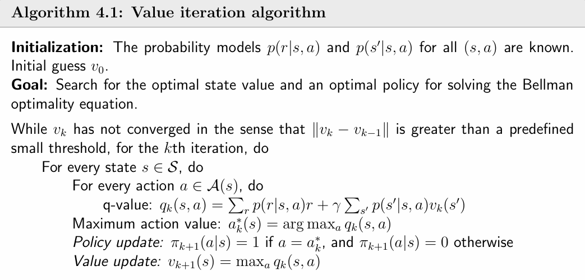|
| ^ |4.2 policy iteration | $$\begin{aligned} & \text{step 1: policy evaluation} \quad \quad v_{k} = r_{\pi_{k}} + \gamma P_{\pi_{k}} v_k \quad \text{(solving BE)}  \\ &\text{step 2: policy improvement} \quad \pi_{k+1} = \arg\max_{\pi} (r_\pi + \gamma P_\pi v_k) \\ & \pi_{k+1}(a \vert s) = \begin{cases} 1, & a = a^*_{k}, \\ 0, & a \neq a^*_{k}. \end{cases} \quad a^*_{k} = \arg\max_{a \in \mathcal{A}} q_{k}(s,a) \end{aligned}$$ 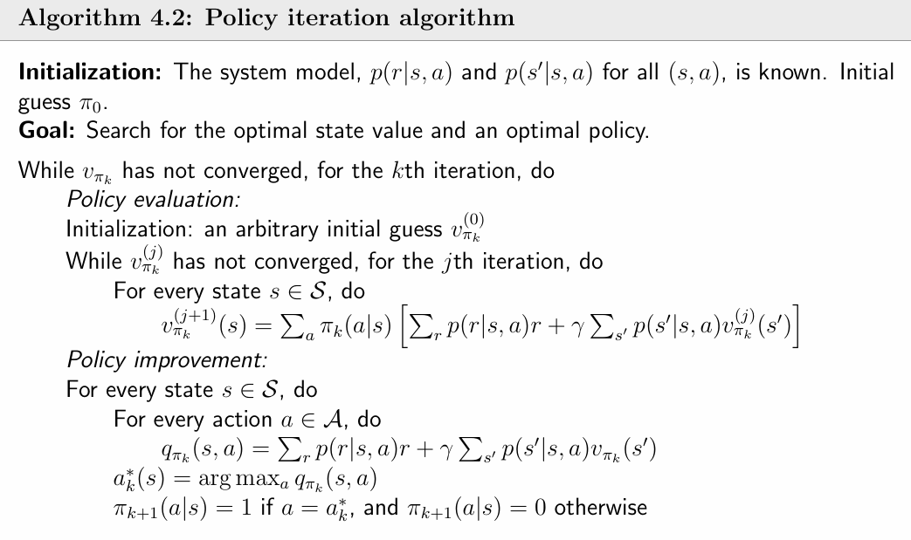|
| ^ | 4.3 truncated policy iteration |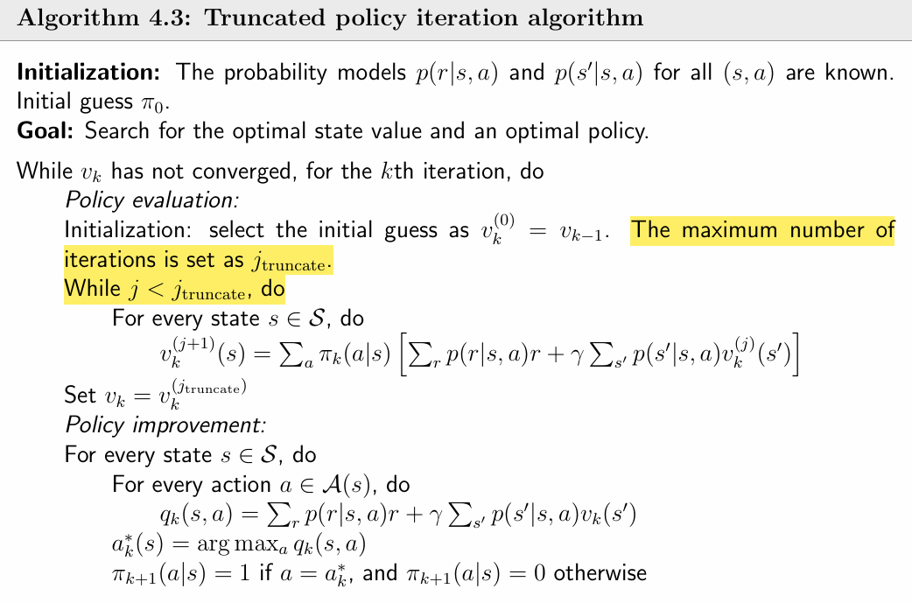|
| Ch5 Monte Carlo Methods | 5.1 Mean estimation| $$\text{model base : }\mathbb{E}[X]=\sum_{x\in\mathcal{X}}p(x)x.$$ $$\text{model free : }\mathbb{E}[X] \approx \bar{x} = \frac{1}{n} \sum_{j=1}^n x_j.$$|
| ^ | 5.2 MC Basic | $$ q_{\pi_k}(s,a) = \mathbb{E}[G_t \vert S_t = s, A_t = a] \approx \frac{1}{n} \sum_{i=1}^{n} g_{\pi_k}^{(i)}(s,a) $$ 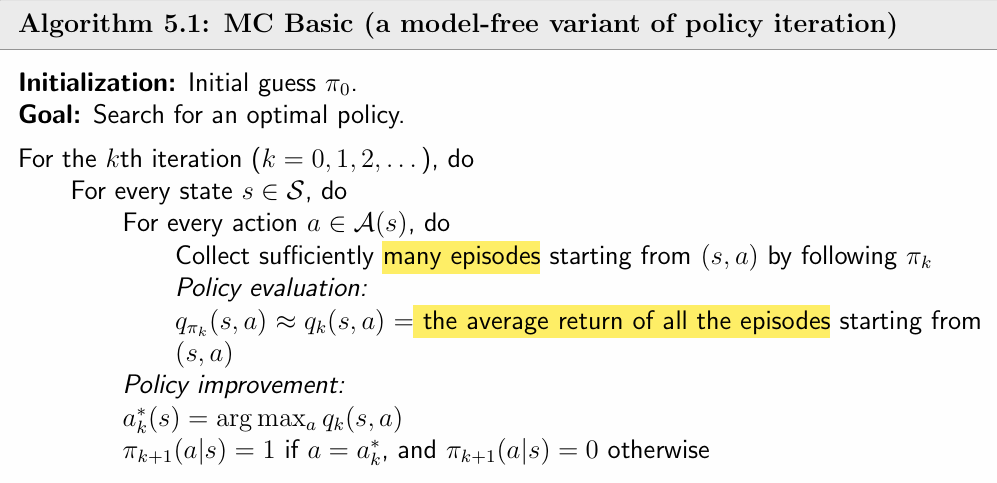 |
| ^ | 5.3 MC Exploring Starts |CC|
| Ch6 Stochastic Approximation | 6.1 Mean estimation in an incremental manner | $$ \text{compute } \mathbb{E}[X] \text{ using } \{x_i\} \\ w_{k+1} = \frac{1}{k}\sum_{i=1}^{k} x_i \\ w_{k+1} = w_k - \frac{1}{k}\bigl(w_k - x_k\bigr) \\ w_{k} \to \mathbb{E}[X] \text{ as } k \to \infty$$|
| ^ | 6.2 Robbins-Monro algorithm| $$\text{solve } g(w) = 0 \text{ using } \{\tilde{g}(w_k,\eta_k)\} \\ w_{k+1} = w_k - a_k \tilde{g}(w_k,\eta_k),\quad k = 1,2,3,\ldots \\ \tilde{g}(w,\eta) = g(w) + \eta \\ w_k \text{: the kth estimate of the root} \\ \tilde{g}(w,\eta) \text{: the kth noisy observation} $$ 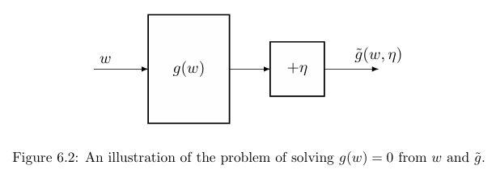 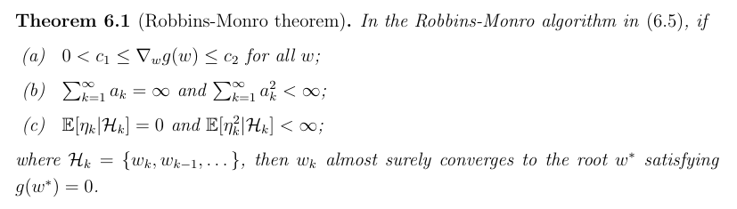 $$\text{Application to mean estimation:} \\ g(w) = w - \mathbb{E}[X] \\  \text{estimate： } \tilde{g}(w,\eta) = w - x = w - x + \mathbb{E}[X] - \mathbb{E}[X] = (w - \mathbb{E}[X]) + (\mathbb{E}[X] - x) = g(w) + \eta \\ w_{k+1} = w_k - \alpha_k \tilde{g}(w_k,\eta_k) = w_k - \alpha_k(w_k - x_k) = w_k - \frac{1}{k}(w_k - x_k) \\ w_{k} \to \mathbb{E}[X] \ \text{if} \sum_{k=1}^{\infty}\alpha_k = \infty,\ \sum_{k=1}^{\infty}\alpha_k^{2} < \infty $$|
| ^ | 6.4 Stochastic gradient descent | $$ \text{minimize } J(w) = \mathbb{E} \left[f(w,X)\right]  \text{ using } \{\nabla_w f(w_k, x_k)\} \\ \text{batch gradient descent: } \\ w_{k+1} = w_k - \alpha_k \nabla_w J(w_k) = w_k - \alpha_k \mathbb{E}[\nabla_w f(w_k, X)] =  w_k - \frac{\alpha_k}{n} \sum_{i=1}^{n} \nabla_w f(w_k, x_i) \\ \text{stochastic gradient descent: } \\ w_{k+1} = w_k - \alpha_k \nabla_w f(w_k, x_k) \quad (BGD, when \ n=1) \\ \text{Application to mean estimation: } \\ \min_w J(w) = \mathbb{E} \left[ \frac{1}{2} \|\|w - X\|\|^2 \right] =  \mathbb{E}[f(w, X)] = \frac{1}{2n} \sum_{i=1}^{n} \|\|w - x_i\|\|^2 \\ f(w, X) = \frac{1}{2} \|\|w - X\|\|^2 , \quad \nabla_w f(w, X) = w - X, \quad \nabla_wJ(w) = \frac{1}{n} \sum_{i=1}^{n} \|\|w - x_i\|\| \\ \text{solving: } \nabla_w J(w) = 0, \ \text{solution: } w^* = \mathbb{E}[X] \\ \text{BGD algorithm: } w_{k+1} = w_k - \alpha_k \nabla_w J(w_k) = w_k - \alpha_k \mathbb{E}[\nabla_w f(w_k, X)] = w_k - \alpha_k \mathbb{E}[w_k - X] \\ = w_k - \alpha_k \frac{1}{n} \sum_{i=1}^{n} (w_k - x_i) = w_k - \alpha_k (w_k - \bar{x}) \\ \text{mean estimation algorithm is a special SGD algorithm: } \\ w_{k+1} = w_k - \alpha_k \nabla_w f(w_k, x_k) = w_k - \alpha_k (w_k - x_k) $$ |
| Ch7 Temporal-Difference Methods| 7.1 TD learning of state values | $$ \text{bellman expectation equation: } v_{\pi}(s) = \mathbb{E} \left[R_{t+1} + \gamma v_{\pi}(S_{t+1}) \mid S_t = s\right] \\ \underbrace{v_{t+1}(s_t)}_{\text{new estimate}} = \underbrace{v_t(s_t)}_{\text{current estimate}} - \alpha_t(s_t)\Bigl[\overbrace{\,v_t(s_t) - \underbrace{\bigl(r_{t+1} + \gamma v_t(s_{t+1})\bigr)}_{\text{TD target }\bar{v}_t}\,}^{\text{TD error }\delta_t}\Bigr] \\ \text{Derivation of the TD algorithm:} \\ g(v_{\pi}(s_t)) = v_{\pi}(s_t) - \mathbb{E} \left[R_{t+1} + \gamma v_{\pi}(S_{t+1}) \mid S_t = s_t\right] = 0 \\ \tilde{g} \bigl(v_{\pi}(s_t)\bigr) = v_{\pi}(s_t) - \bigl[r_{t+1} + \gamma v_{\pi}(s_{t+1})\bigr] \\ = \underbrace{\Bigl(v_{\pi}(s_t) - \mathbb{E} \left[R_{t+1} + \gamma v_{\pi}(S_{t+1}) \mid S_t  = s_t\right]\Bigr)}_{g(v_{\pi}(s_t))} \\ + \underbrace{\Bigl(\mathbb{E} \left[R_{t+1} + \gamma v_{\pi}(S_{t+1}) \mid S_t = s_t\right] - \bigl[r_{t+1} + \gamma v_{\pi}(s_{t+1})\bigr]\Bigr)}_{\eta} \\ \text{the RM algorithm for solving } g(v_{\pi}(s_t)) = 0 \\ v_{t+1}(s_t) = v_t(s_t) - \alpha_t(s_t)\tilde{g} \bigl(v_t(s_t)\bigr) \\ = v_t(s_t) - \alpha_t(s_t)\Bigl(v_t(s_t) - \bigl[r_{t+1} + \gamma v_{\pi}(s_{t+1})\bigr]\Bigr) $$|
| ^ | 7.2 TD learning of action values: Sarsa| $$ \text{experience samples: } (s_t, a_t, r_{t+1}, s_{t+1}, a_{t+1}) \\ \text{Sarsa: }  q_{t+1}(s_t, a_t) = q_t(s_t, a_t) - \alpha_t(s_t, a_t) \left[ q_t(s_t, a_t) - (r_{t+1} + \gamma q_t(s_{t+1}, a_{t+1})) \right] $$ 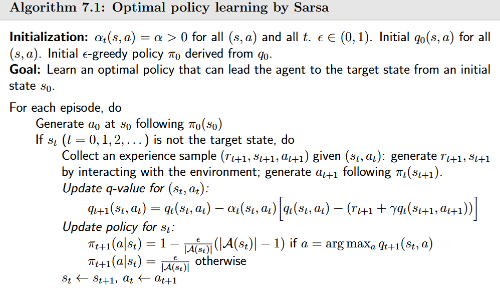 |
| ^ | 7.3 TD learning of action values: n-step Sarsa| $$ \text{experience samples: } (s_t, a_t, r_{t+1}, s_{t+1}, a_{t+1}, \dots, r_{t+n}, s_{t+n}, a_{t+n}) \\ \text{n-step Sarsa: } \\ q_{t+n}(s_t, a_t) = q_{t+n-1}(s_t, a_t) - \alpha_{t+n-1}(s_t, a_t) \left[ q_{t+n-1}(s_t, a_t) - (r_{t+1} + \gamma r_{t+2} + \cdots + \gamma^n q_{t+n-1}(s_{t+n}, a_{t+n})) \right] $$ |
| ^ | 7.4 TD learning of optimal action values: Q-learning| $$ \text{Bellman optimality equation expressed in terms of action values: } \\ q(s, a) = \mathbb{E} \left[ R_{t+1} + \gamma \max_a q(S_{t+1}, a) \vert S_t = s, A_t = a \right] \\ \text{Q-learning:} \\ q_{t+1}(s_t, a_t) = q_t(s_t, a_t) - \alpha_t(s_t, a_t) \left[ q_t(s_t, a_t) - (r_{t+1} + \gamma \max_{a \in \mathcal{A}(s_{t+1})} q_t(s_{t+1}, a)) \right] \\ \text{The behavior policy is the one used to generate experience samples} \\ \text{The target  policy is the one that is constantly updated to converge to an optimal policy.} \\ \text{on-policy: target policy = behavior policy} \\ \text{off-policy: target policy} \neq \text{behavior policy}$$ 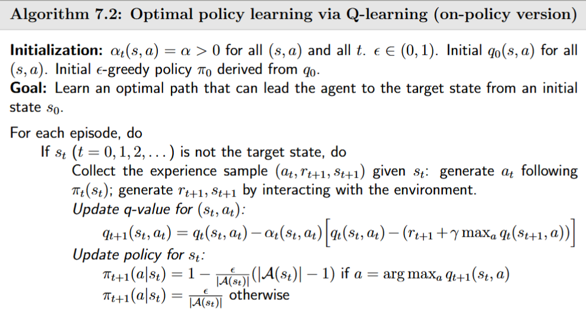 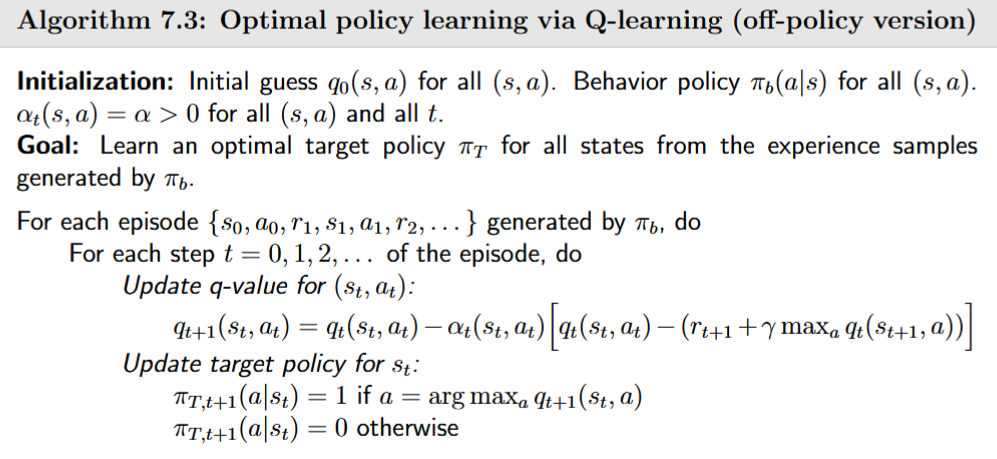| 
| Ch8 Value Function Methods| 8.1 Value representation: From table to function | $$ \hat{v}(s,w) = as+b = [s,1] \underbrace{\begin{bmatrix} a \\ b \end{bmatrix}}_{w} = \phi^{\top}(s)w $$|
| ^ | 8.2 TD learning of state values based on function approximation| $$\text{objective function: } J(w)=\mathbb{E}\!\left[\left(v_{\pi}(S)-\hat{v}(S,w)\right)^2\right] \\ \text{stationary distribution: } J(w)=\sum_{s\in\mathcal{S}} d_{\pi}(s)\,\bigl(v_{\pi}(s)-\hat{v}(s,w)\bigr)^2 \\ \text{gradient descent algorithm: } w_{k+1}=w_k-\alpha_k\,\nabla_{w}J(w_k) \\  w_{k+1} = w_k + 2\alpha_k\, \mathbb{E} \left[ \bigl(v_{\pi}(S)-\hat{v}(S,w_k)\bigr)\, \nabla_{w}\hat{v}(S,w_k) \right] \\ \text{replace the true gradient with stochastic gradient: } \\ w_{t+1} = w_t + \alpha_t\bigl(v_{\pi}(s_t)-\hat{v}(s_t,w_t)\bigr)\nabla_w \hat{v}(s_t,w_t) \\ \text{replace the true state value } v_{\pi}(s_t) \text{ with  an approximation,} \\ \text{Monte Carlo method: } \\ w_{t+1} = w_t + \alpha_t\bigl(g_t-\hat{v}(s_t,w_t)\bigr)\nabla_w \hat{v}(s_t,w_t) \\ \text{Temporal-difference method: } \\ w_{t+1} = w _t + \alpha_t\bigl[r_{t+1} + \gamma \hat{v}(s_{t+1},w_t) - \hat{v}(s_t,w_t)\bigr]\nabla_w \hat{v}(s_t,w_t) $$|
| ^ | 8.3 TD learning of action values based on function  approximation | $$ \text{Sarsa with function approximation: } \\ w_{t+1} = w_t + \alpha_t\bigl[r_{t+1} + \gamma \hat{q}(s_{t+1},a_{t+1},w_t) - \hat{q}(s_t,a_t,w_t)\bigr]\nabla_w \hat{q}(s_t,a_t,w_t) $$ 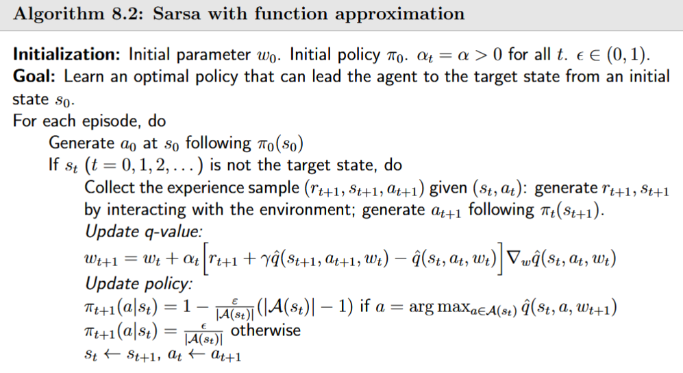 $$ \text{Q-learning with function approximation: } \\  w_{t+1} = w_t + \alpha_t\Bigl[r_{t+1} + \gamma \max_{a\in\mathcal{A}(s_{t+1})}\hat{q}(s_{t+1},a,w_t) - \hat{q}(s_t,a_t,w_t)\Bigr]\nabla_w \hat{q}(s_t,a_t,w_t) $$ 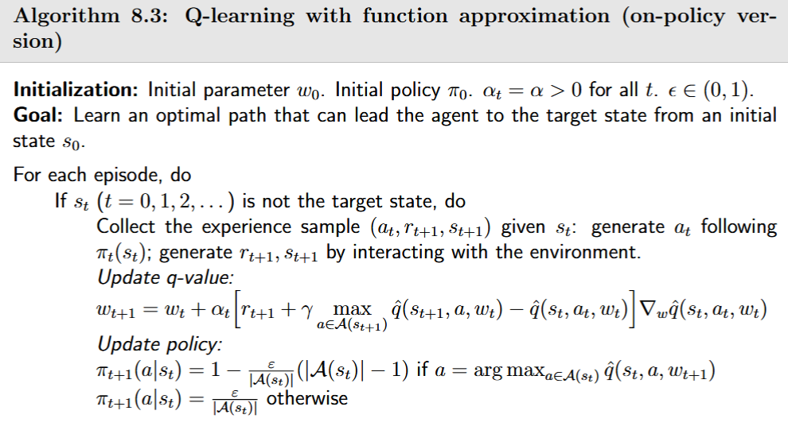|
| ^ | 8.4 Deep Q-learning | $$ \text{loss function: } \\ J(w) = \mathbb{E} \left[\left(\underbrace{R + \gamma \max_{a\in\mathcal{A}(S')}\hat{q}(S',a,w_T)}_{\text{target network}} - \underbrace{\hat{q}(S,A,w)}_{\text{main network}}\right)^2\right] \\ \text{when } w_T \text{ is fixed, the gradient of J is: } \\ \nabla_w J = -\mathbb{E} \left[\left(R + \gamma \max_{a\in\mathcal{A}(S')}\hat{q}(S',a,w_T) - \hat{q}(S,A,w)\right)\nabla_w \hat{q}(S,A,w)\right] $$ $$\begin{aligned} & \text{Deep Q-learning techniques:} \\ & \bullet \text{two networks} \\ & \bullet \text{experience replay} \end{aligned}$$|
| Ch9 Policy Gradient Methods | 9.1 Policy representation: From table to function |$$\theta_{t+1} = \theta_t + \alpha \nabla_{\theta} J(\theta_t), \text{where } \theta \text{ is a parameter vector for policy} $$ 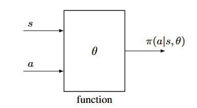|
| ^ | 9.2 Metrics for defining optimal policies| $$\text{Metric 1: average state value}$$ $$J(\theta) = \mathbb{E} \left[\sum_{t=0}^{\infty}\gamma^{t}R_{t+1}\right] = \sum_{s\in\mathcal{S}} d(s)\,\mathbb{E} \left[\sum_{t=0}^{\infty}\gamma^{t}R_{t+1}\vert S_0=s\right] = \sum_{s\in\mathcal{S}} d(s) v_{\pi}(s) = \mathbb{E}_{S\sim d} \left[v_{\pi}(S)\right] = \bar{v}_{\pi}.$$ $$\text{Metric 2: average one-step reward}$$ $$J(\theta) = \lim_{n\to\infty}\frac{1}{n} \mathbb{E} \left[\sum_{t=0}^{n-1} R_{t+1}\right] = \sum_{s\in\mathcal{S}} d_{\pi}(s)\,r_{\pi}(s) = \mathbb{E}_{S\sim d_{\pi}} \left[r_{\pi}(S)\right] = \bar{r}_{\pi}$$|
| ^ | 9.3 Gradients of the metrics | $$ \text{policy gradient theorem :}$$ $$\nabla_{\theta}J(\theta) = \sum_{s\in\mathcal{S}}\eta(s)\sum_{a\in\mathcal{A}} \nabla_{\theta}\pi(a\vert s,\theta)\,q_{\pi}(s,a) = \sum_{s\in\mathcal{S}}\eta(s)\sum_{a\in\mathcal{A}} \pi(a\vert s,\theta) \nabla_{\theta} \ln \pi(a\vert s,\theta)\,q_{\pi}(s,a) \\ = \mathbb{E}_{S\sim\eta,\;A\sim\pi(S,\theta)} \left[\nabla_{\theta}\ln \pi(A\vert S,\theta)\,q_{\pi}(S,A)\right],\quad \text{for all (s,a),}\ \pi(a\vert s,\theta) > 0 \\ \text{softmax: } \pi(a \vert s, \theta) = \frac{e^{h(s,a,\theta)}}{\sum_{a' \in A} e^{h(s,a',\theta)}} $$ 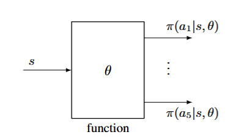|
| ^ | 9.4 Monte Carlo policy gradient (REINFORCE)| $$ \theta_{t+1} = \theta_t + \alpha \nabla_{\theta}\ln \pi(a_t \vert s_t, \theta_t)\, q_t(s_t, a_t)$$ 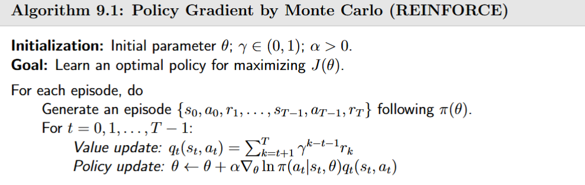|
| Ch10 Actor-Critic Methods | 10.1 QAC | $$\begin{aligned} & \text{actor: policy update } \theta \\ & \text{critic: action value update } q_t(s_t, a_t) \text{ using TD learning(Sarsa)} \end{aligned}$$ 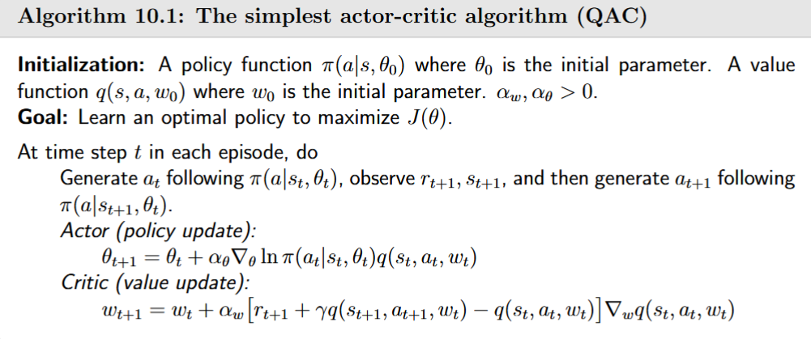|
| ^ | 10.2 Advantage actor-critic (A2C) | $$\text{core idea: introduce a baseline } b(\pi) = v_{\pi}(s) \text{ to reduce estimation variance} \\ \theta_{t+1} = \theta_t + \alpha \nabla_\theta \ln \pi(a_t \vert s_t, \theta_t) [q_t(s_t, a_t) - v_t(s_t)] = \theta_t + \alpha \nabla_\theta \ln \pi(a_t \vert s_t, \theta_t) \delta_t(s_t, a_t) \\ \text{the advantage function: } \delta_t(s_t, a_t) = q_t(s_t, a_t) - v_t(s_t) \approx r_{t+1} + \gamma v_t(s_{t+1}) - v_t(s_t) \text{ (TD error)} $$ 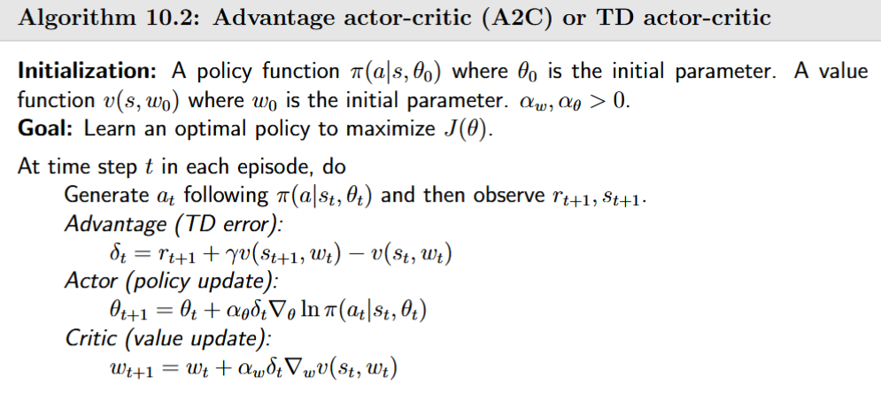|
| ^ | 10.3 Off-policy actor-critic | $$\text{Importance sampling: approximate } \mathbb{E}_{X \sim p_0}[X] \text{ use the samples } \{x_i\} \text{ generated by another distribution } p_1 \\ \mathbb{E}_{X \sim p_0}[X] = \sum_{x \in \mathcal{X}} p_0(x)x = \sum_{x \in \mathcal{X}} p_1(x) \underbrace{\frac{p_0(x)}{p_1(x)}}_{f(x)} x = \mathbb{E}_{X \sim p_1}[f(X)] \\ \mathbb{E}_{X \sim p_0}[X] = \mathbb{E}_{X \sim p_1}[f(X)] \approx \bar{f} = \frac{1}{n} \sum_{i=1}^n f(x_i) = \frac{1}{n} \sum_{i=1}^n \underbrace{\frac{p_0(x_i)}{p_1(x_i)}}_{\text{importance weight}} x_i \\ \text{Off-policy policy gradient: } \\ J(\theta) = \sum_{s \in S} d_\beta(s) v_\pi(s) = \mathbb{E}_{S \sim d_\beta}[v_\pi(S)] \\ \beta \text{: behavior policy} \\ d_{\beta} \text{: the stationary distribution under policy } \beta \\ \nabla_{\theta} J(\theta) = \mathbb{E}_{S \sim \rho, A \sim \beta} \left[ \underbrace{\frac{\pi(A \vert S, \theta)}{\beta(A \vert S)}}_{\text{importance weight}} \nabla_{\theta} \ln \pi(A \vert S, \theta) q_{\pi}(S, A) \right] $$ 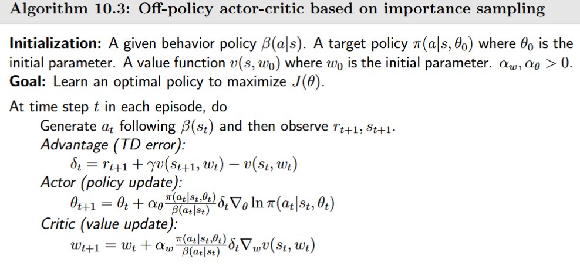|
| ^ | 10.4 Deterministic actor-critic (DPG) | $$ J(\theta) = \mathbb{E}[v_\mu(s)] = \sum_{s \in \mathcal{S}} d_0(s) v_\mu(s) \\ \mu \text{ : deterministic policy} \\ d_0 \text{ : the probability distribution of the states} \\ \nabla_\theta J(\theta) = \sum_{s \in \mathcal{S}} \eta(s) \nabla_\theta \mu(s) (\nabla_a q_\mu(s, a))\vert_{a=\mu(s)} = \mathbb{E}_{S \sim \eta} \left[ \nabla_\theta \mu(S) (\nabla_a q_\mu(S, a)) \vert_{a=\mu(S)} \right] $$ 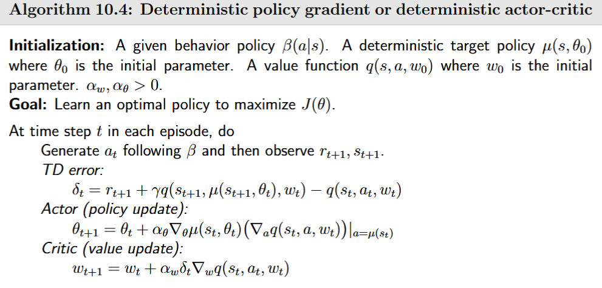 |

tools:
| Ch0  | 10.1 |dd |

&bull;
$\bullet$
$$\mathbb{E}[X]\; \text{if}      % 小空格（常用）$$
$$\mathbb{E}[X]\: \text{if}      % 略大$$
$$\mathbb{E}[X]\ \text{if}       % 普通空格$$
$$\mathbb{E}[X]\quad \text{if}   % 更大空格$$
$$\mathbb{E}[X]\qquad \text{if}  % 超大空格$$
$$ x \neq y, \quad a > b, \quad c \leq d, \quad e \geqslant f $$

 
 
