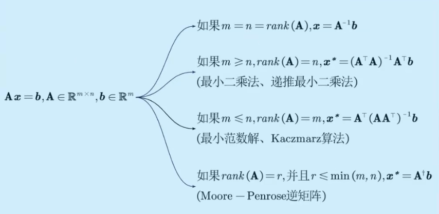
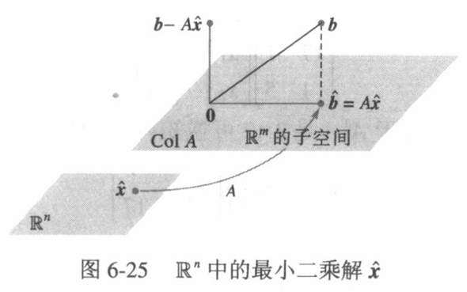
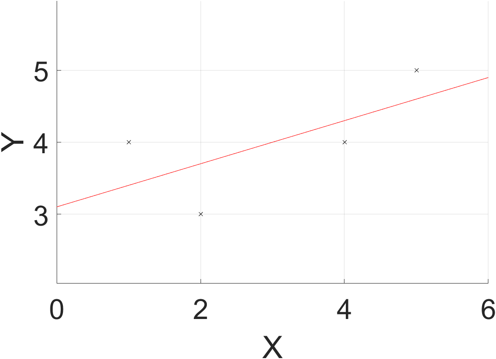
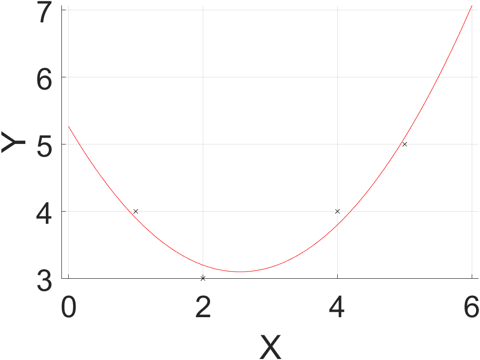

# 求解线性方程组(1)_最小二乘法


对于$\mathbf{Ax=b}, \mathbf{A} \in \mathbb{R}^{m \times n}, \mathbf{b} \in \mathbb{R}^m.$
如果 $ m \geq n , \text{rank}(\mathbf{A}) = n , $ 则最小二乘法解 $\mathbf{\hat{x} = (A^{\top} A)^{-1}A^{\top} b}$

解释：如果未知数个数不大于方程数量时，方程组无解。对于这样一个不存在解的方程组$\mathbf{Ax=b}$，希望寻找一个$\mathbf{x}$，使得 $\mathbf{Ax}$ 尽可能接近 $\mathbf{b}$，也就是$\|\mathbf{Ax-b}\|$尽可能小。优化目标函数表示为
$$
\mathbf{min}\, f(x)=\|\mathbf{Ax-b}\|^2
$$
几何上，$\mathbf{Ax}$属于$\text{Col}A$，$\mathbf{\hat{b}=A\hat{x}}$ 是 $\mathbf{b}$ 在 $\text{Col}A$ 上的正交投影，是$\text{Col}A$中最接近$\mathbf{b}$的向量。因为$\|\mathbf{Ax-b}\|^2 \geq \|\mathbf{A\hat{x}-b}\|^2$，所以$\mathbf{\hat{x}}$为$\mathbf{Ax=b}$的最小二乘解。

图片来自《线性代数及其应用》P359

根据正交投影的性质，$\mathbf{b-A\hat{x}}$与$\text{Col}A$中的每一列都正交。如果$\mathbf{a_{j}}$表示$\text{Col}A$中的任意列，那么$\mathbf{a_j}^{\top}(\mathbf{b-A\hat{x}})=0$，由于每一个$\mathbf{a_{j}^{\top}}$是$\mathbf{A^{\top}}$的行，$$\mathbf{A^{\top}(b-A\hat{x})=0}$$故有$$\mathbf{A^{\top}A\hat{x}=A^{\top}b}$$ $$\mathbf{\hat{x} = (A^{\top} A)^{-1}A^{\top} b}
$$关于$\mathbf{\hat{x}}$更详细的推导参考《最优化导论》P153
如果$\mathbf{A}$的列线性无关，最小二乘解可通过$\mathbf{A}$的$\mathbf{QR}$分解求出
$$\mathbf{\hat{x}=R^{-1}Q^{\top}b}$$详情见《线性代数及其应用》P363


## 例1 直线拟合
平面上有一组数据点$(1,4),(2,3),(4,4),(5,5)$，图像近似一条直线。希望寻找一条预测直线$y=ax+b$尽可能接近这些点，使得余差$y-y_i$的平方和最小$$\min \sum (y - y_i)^2$$此处$y$是预测值，$y_i$是观测值，预测值与观测值的差称为余差。待定参数$a,b$需要使余差的平方和最小。
如果数据点在直线上，参数$a,b$满足线性方程组：
$$
\begin{cases}ax_1 + b= y_1 \\ ax_2 + b = y_2 \\ ax_3 + b = y_3 \\ ax_4 + b = y_4\end{cases}
$$写成矩阵形式$\mathbf{Ax=b}$为
$$
\begin{pmatrix}x_1 & 1 \\ x_2 & 1 \\ x_3 & 1 \\ x_4 & 1\end{pmatrix}\begin{pmatrix}a \\ b \end{pmatrix} = \begin{pmatrix}y_1\\ y_2\\ y_3 \\ y_4\end{pmatrix}
$$其中$\mathbf{Ax}$是预测向量，$\mathbf{b}$是观测向量。
如果数据点不在直线上，方程组$\mathbf{Ax=b}$无解，但是可以使用最小二乘法$\mathbf{\hat{x} = (A^{\top} A)^{-1}A^{\top} b}$计算出一条余差和最小的直线。

除了使用直线拟合数据点，也可以使用其他曲线，比如抛物线$y=ax^{2}+bx+c$，此时$\mathbf{Ax=b}$为
$$
\begin{pmatrix}x_1^2 & x_1 & 1 \\ x_2^2 & x_2 & 1 \\ x_3^2 & x_3 & 1 \\ x_4^2 & x_4 & 1\end{pmatrix}\begin{pmatrix}a \\ b \\ c \end{pmatrix} = \begin{pmatrix}y_1\\ y_2\\ y_3 \\ y_4\end{pmatrix}
$$

以下为matlab脚本实现：
```
clear
clc
set(groot, 'DefaultAxesFontSize', 30);

% 数据为二维平面中的点(x_i, y_i)
x = [1, 2, 4, 5];
y = [4, 3, 4, 5];

% 用直线拟合 y = a*x  + b
% A = [x', ones(length(x),1)];
% 用二次函数拟合 y = a*x^2 + b*x + c
A = [x'.^2, x', ones(length(x),1)];
b = y';

% 利用最小二乘法实现拟合
% Ax=b无解，寻找x_hat，使得A*x_hat尽可能接近b
x_hat = inv(A' * A) * A' * b;
b_hat = A * x_hat; % b在Col(A)中的投影


% 显示拟合结果
t = 0:0.1:6;
% y_hat = x_hat(1) * t + x_hat(2);
y_hat = x_hat(1) * t.^2 + x_hat(2) * t + x_hat(3);

hold on;
plot(x, y, 'k.', 'Marker','x');
plot(t, y_hat, 'r');
xlabel('X');
ylabel('Y');
hold off;
grid;
axis equal;
```