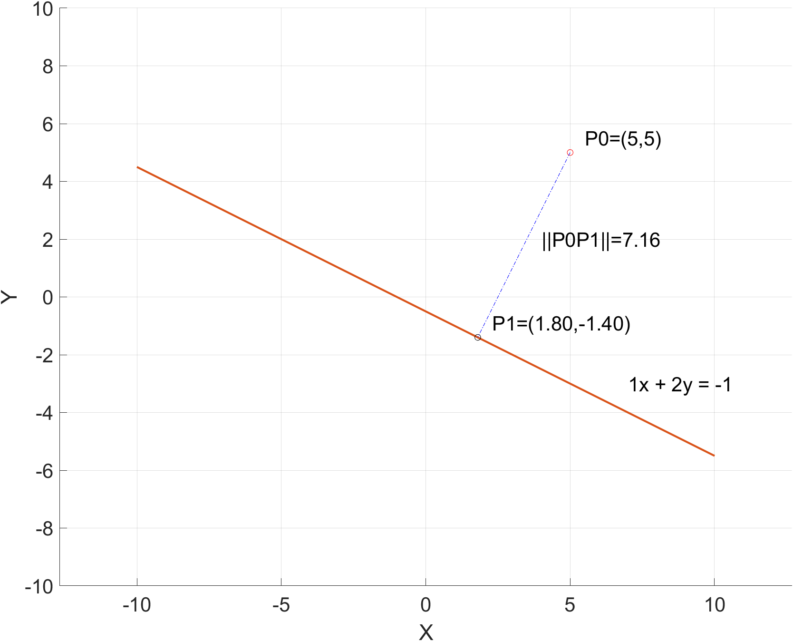

# 求解线性方程组(2)：最小范数解
对于$\mathbf{A}\mathbf{x} = \mathbf{b}, \mathbf{A} \in \mathbb{R}^{m \times n}, \mathbf{b} \in \mathbb{R}^m.$
如果 $ m \leq n , \text{rank}(\mathbf{A}) = m , $ 则最小范数解 $\bm{\hat{x} = A^{\top} (AA^{\top})^{-1} b}$

解释：如果方程数量不超过未知数个数时，该方程组存在无穷多个解。举一个最简单的例子，$x + 2y = -1$ 存在无数解 $\bm{x}=(x,y)^{\top}, $ 但是只存在一个最接近原点的解，即有唯一最小范数$\|x\|$解$\bm{\hat{x}}$。证明见《最优化导论》P161。

$\bm{\hat{x}}$是如下优化问题的解：
$$\min \|\bm{x}\| \\ 
\text{subject to } \bm{Ax = b}$$

## 例1 求点到直线的最短距离和垂点（平面内）
已知有一条直线 $ax + by = c$ 和直线外一点 $P_0=(x_0,y_0)$。$P_0$到直线上任意一点的距离为 $\sqrt{(\Delta x)^2 + (\Delta y)^2}$。如果从$P_0$到直线做垂线，垂足为$P_1=(x_1, y_1)$，满足方程 $ax_1 + by_1 = c$ ,可以得到最短距离为$\min \left( \sqrt{(\Delta x)^2 + (\Delta y)^2} \right)$ , 其中$\Delta x = x_1 - x_0$，$\Delta y = y_1 - y_0$



```
% 利用最小范数法求解点到直线的最短距离和垂点
clear all
clc
set(groot, 'DefaultAxesFontSize', 20);

% 创建坐标轴
figure;
grid on;
axis([-10 10 -10 10]);
axis equal;
xlabel('X');
ylabel('Y');

% 原始点
P0 = [5;5];
% 平面方程 ax + by = c
a = 1; b = 2; c = -1;

hold on;
% 绘制P0
plot(P0(1), P0(2), 'ro');

% 定义直线
x = -10:0.1:10;
y = (c - a*x)/b;
% 绘制直线
plot(x, y);

% 计算垂点P1
A = [a, b];
% x_hat = P1 - P0
x_hat =  A'*inv(A*A')*(-A*P0+c);
P1 = A'*inv(A*A')*(-A*P0+c)+P0;

% 绘制垂点
plot(P1(1), P1(2), 'ko');
% 绘制垂线
plot([P0(1), P1(1)], [P0(2), P1(2)], 'b-.');

% 绘制标签
P0_label = sprintf('P0=(%d,%d)', P0(1), P0(2));
text(P0(1)+0.5, P0(2)+0.5, P0_label, 'FontSize', 20, 'Color', 'black');
P1_label = sprintf('P1=(%.2f,%.2f)', P1(1), P1(2));
text(P1(1)+0.5, P1(2)+0.5, P1_label, 'FontSize', 20, 'Color', 'black');
line_label = sprintf('%dx + %dy = %d', a, b, c);
text(7, -3, line_label, 'FontSize', 20, 'Color', 'black');
d_label = sprintf('||P0P1||=%.2f', norm(x_hat));
text(4, 2, d_label, 'FontSize', 20, 'Color', 'black');

hold off;
```
