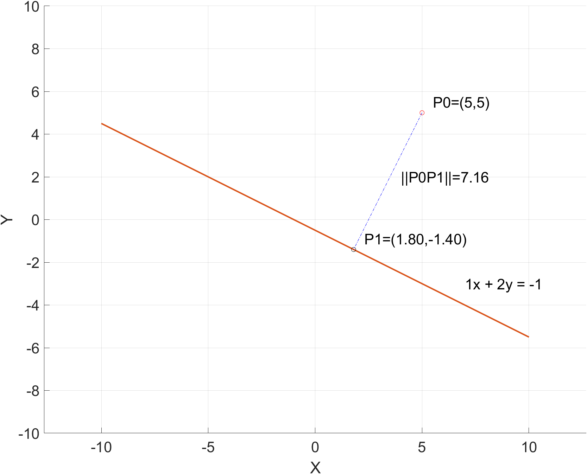
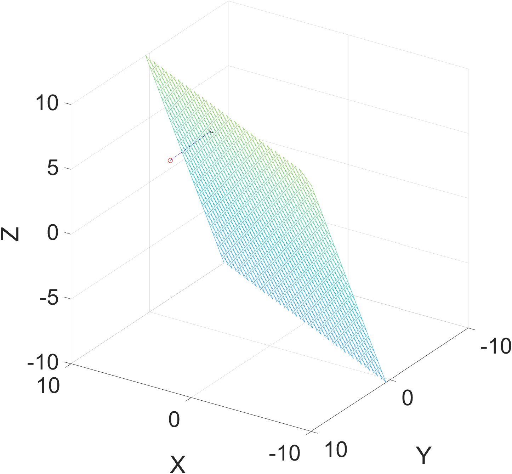
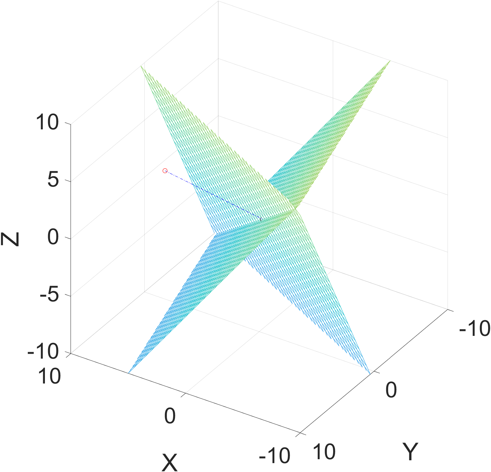

# 求解线性方程组(2)：最小范数解
对于$\mathbf{A}\mathbf{x} = \mathbf{b}, \mathbf{A} \in \mathbb{R}^{m \times n}, \mathbf{b} \in \mathbb{R}^m.$
如果 $ m \leq n , \text{rank}(\mathbf{A}) = m , $ 则最小范数解 $\mathbf{\hat{x} = A^{\top} (AA^{\top})^{-1} b}$

解释：如果方程数量不超过未知数个数时，该方程组存在无穷多个解。举一个最简单的例子，$x + 2y = -1$ 存在无数解 $\mathbf{x}=(x,y)^{\top}$， 几何上即这条直线上的所有点的集合，但是直线上只存在一个最接近原点的点，即有唯一最小范数解$\mathbf{\hat{x}}$（范数$\|x\|$表示一个向量的模）。证明见《最优化导论》P161。
$\mathbf{\hat{x}}$是如下优化问题的解：
$$\min \|\mathbf{x}\| \\ \text{subject to} \mathbf{Ax = b}$$

## 例1 求平面内点到直线的最短距离和垂点
已知有一条直线 $ax + by = c$ 和直线外一点 $P_0=(x_0,y_0)$。$P_0$到直线上任意一点的距离为 $\sqrt{(\Delta x)^2 + (\Delta y)^2}$。如果从$P_0$到直线做垂线，垂足为$P_1=(x_1, y_1)$，满足方程 $ax_1 + by_1 = c$ 。点到直线最短距离为$\min \left( \sqrt{(\Delta x)^2 + (\Delta y)^2} \right)$ , 其中$\Delta x = x_1 - x_0$，$\Delta y = y_1 - y_0$，约束方程为$a\Delta x + b\Delta y=-(ax_0+by_0)+c$。约束方程表示为矩阵形式，即
$$
\mathbf{Ax}=\begin{pmatrix}a & b\end{pmatrix} \begin{pmatrix}\Delta x \\ \Delta y\end{pmatrix} = -\begin{pmatrix}a & b\end{pmatrix}\begin{pmatrix}x_0 \\ y_0\end{pmatrix} + c = \mathbf{b}
$$
最小范数解 $\mathbf{\hat{x} =\begin{pmatrix}\Delta x \\ \Delta y\end{pmatrix}= A^{\top} (AA^{\top})^{-1} b = A^{\top} (AA^{\top})^{-1} \left(-A\begin{pmatrix}x_0 \\ y_0\end{pmatrix}+c \right)}$


垂点$P_1$可表示为 $ \mathbf{\begin{pmatrix} x_1 \\ y_1\end{pmatrix}= A^{\top} (AA^{\top})^{-1} \left(-A\begin{pmatrix}x_0 \\ y_0\end{pmatrix}+c \right)+\begin{pmatrix}x_0 \\ y_0\end{pmatrix}}$


以下为matlab脚本实现：
```
% 利用最小范数法求解点到直线的最短距离和垂点
clear all
clc
set(groot, 'DefaultAxesFontSize', 20);

% 创建坐标轴
figure;
grid on;
axis([-10 10 -10 10]);
axis equal;
xlabel('X');
ylabel('Y');

% 原始点
P0 = [5;5];
% 平面方程 ax + by = c
a = 1; b = 2; c = -1;

hold on;
% 绘制P0
plot(P0(1), P0(2), 'ro');

% 定义直线
x = -10:0.1:10;
y = (c - a*x)/b;
% 绘制直线
plot(x, y);

% 计算垂点P1
A = [a, b];
% x_hat = P1 - P0
x_hat =  A'*inv(A*A')*(-A*P0+c);
P1 = A'*inv(A*A')*(-A*P0+c)+P0;

% 绘制垂点
plot(P1(1), P1(2), 'ko');
% 绘制垂线
plot([P0(1), P1(1)], [P0(2), P1(2)], 'b-.');

% 绘制标签
P0_label = sprintf('P0=(%d,%d)', P0(1), P0(2));
text(P0(1)+0.5, P0(2)+0.5, P0_label, 'FontSize', 20, 'Color', 'black');
P1_label = sprintf('P1=(%.2f,%.2f)', P1(1), P1(2));
text(P1(1)+0.5, P1(2)+0.5, P1_label, 'FontSize', 20, 'Color', 'black');
line_label = sprintf('%dx + %dy = %d', a, b, c);
text(7, -3, line_label, 'FontSize', 20, 'Color', 'black');
d_label = sprintf('||P0P1||=%.2f', norm(x_hat));
text(4, 2, d_label, 'FontSize', 20, 'Color', 'black');

hold off;
```
## 例2 求空间中点到平面的最短距离和垂点
已知三维空间中有一个平面 $ax + by +cz = d$ 和平面外一点 $P_0=(x_0,y_0,z_0)$。从$P_0$到平面上任意一点的距离为 $\sqrt{(\Delta x)^2 + (\Delta y)^2 + (\Delta z)^2}$。如果从$P_0$到平面做垂线，垂足为$P_1=(x_1,y_1,z_1)$，满足方程 $ax_1 + by_1 +cz_1= d$ 。点到平面最短距离为$$\min \left( \sqrt{(\Delta x)^2 + (\Delta y)^2 + (\Delta z)^2} \right)$$ , 其中$\Delta x = x_1 - x_0$，$\Delta y = y_1 - y_0$，$\Delta z = z_1 - z_0$ 。约束方程为$a\Delta x + b\Delta y + c\Delta z=-(ax_0+by_0+cz_0)+d$。约束方程表示为矩阵形式，即
$$
\mathbf{Ax}=\begin{pmatrix}a & b & c\end{pmatrix} \begin{pmatrix}\Delta x \\ \Delta y \\ \Delta z\end{pmatrix} = -\begin{pmatrix}a & b & c\end{pmatrix}\begin{pmatrix}x_0 \\ y_0 \\ z_0\end{pmatrix} + d = \mathbf{b}
$$
最小范数解 $\mathbf{\hat{x} =\begin{pmatrix}\Delta x \\  \Delta y \\ \Delta z\end{pmatrix}= A^{\top} (AA^{\top})^{-1} b = A^{\top} (AA^{\top})^{-1}} \left(-\mathbf{A}\begin{pmatrix}x_0 \\ y_0 \\ z_0\end{pmatrix} + d \right)$


垂点$P_1$可表示为 $ \mathbf{\begin{pmatrix} x_1 \\ y_1 \\ z_1\end{pmatrix}= A^{\top} (AA^{\top})^{-1} }\left(-\mathbf{A}\begin{pmatrix}x_0 \\ y_0 \\ z_0\end{pmatrix} + d \right)+\begin{pmatrix}x_0 \\ y_0 \\ z_0\end{pmatrix}$


以下为matlab脚本实现：

```
clear
clc
set(groot, 'DefaultAxesFontSize', 30);

% 创建坐标轴
figure;
grid on;
axis([-10 10 -10 10 -10 10]);
axis equal;
xlabel('X');
ylabel('Y');
zlabel('Z');

% 原始点
P0 = [5;5;5];
% 平面方程 ax + by + cz = d
a = 1; b = 2; c = -1; d = 1;

hold on;

% 绘制P0
plot3(P0(1), P0(2), P0(3), 'ro');

% 生成网格点
[u, v] = meshgrid(-10:0.5:10);

%绘制平面
z = (d - a.*u - b.*v)/c;
mesh(u, v, z);


% 计算P0到平面的垂点P1
A = [a, b, c];
P1 = A'*inv(A*A')*(-A*P0+d)+P0;

% 绘制垂点
plot3(P1(1), P1(2), P1(3), 'ko');

% 绘制垂线
plot3([P0(1), P1(1)], [P0(2), P1(2)], [P0(3), P1(3)], 'b-.');
hold off;
view(120,30);
```
## 例3 求空间中点到两平面交线的最短距离和垂点
已知三维空间中两个平面的交线
$$\begin{cases}a_1x + b_1y +c_1z = d_1 \\ a_2x + b_2y +c_2z = d_2\end{cases}$$ 和平面外一点 $P_0=(x_0,y_0,z_0)$。与例二类似，点到平面交线的最短距离为
$$\min \left( \sqrt{(\Delta x)^2 + (\Delta y)^2 + (\Delta z)^2} \right)$$
约束方程为
$$
\mathbf{Ax}=\begin{pmatrix}a_1 & b_1 & c_1 \\ a_2 & b_2 & c_2\end{pmatrix} \begin{pmatrix}\Delta x \\ \Delta y \\ \Delta z\end{pmatrix} = -\begin{pmatrix}a_1 & b_1 & c_1 \\ a_2 & b_2 & c_2\end{pmatrix}\begin{pmatrix}x_0 \\ y_0 \\ z_0\end{pmatrix} + \begin{pmatrix}d_1 \\ d_2\end{pmatrix} = \mathbf{b}
$$
最小范数解 $\mathbf{\hat{x} =\begin{pmatrix}\Delta x \\  \Delta y \\ \Delta z\end{pmatrix}= A^{\top} (AA^{\top})^{-1} b}$


以下为matlab脚本实现：

```
% MinimumNormSolution_3d_demo2
clear
clc
set(groot, 'DefaultAxesFontSize', 30);

% 创建坐标轴
figure;
grid on;
axis([-10 10 -10 10 -10 10]);
axis equal;
xlabel('X');
ylabel('Y');
zlabel('Z');

% 原始点
P0 = [5;5;5];
% 平面方程1: a1*x + b1*y + c1*z = d1
a1 = 1; b1 = 2; c1 = -1; d1 = 1;
% 平面方程2: a2*x + b2*y + c2*z = d2
a2 = 4; b2 = 1; c2 = 3; d2 = 0;

hold on;

% 绘制P0
plot3(P0(1), P0(2), P0(3), 'ro');

% 生成网格点
[u, v] = meshgrid(-10:0.5:10);

%绘制平面
z1 = (d1 - a1.*u - b1.*v)/c1;
mesh(u, v, z1);
z2 = (d2 - a2.*u - b2.*v)/c2;
mesh(u, v, z2);


% 计算P0到平面的垂点P1
A = [a1, b1, c1; 
     a2, b2, c2];
D = [d1;d2];
P1 = A'*inv(A*A')*(-A*P0+D)+P0;

% 绘制垂点
plot3(P1(1), P1(2), P1(3), 'ko');

% 绘制垂线
plot3([P0(1), P1(1)], [P0(2), P1(2)], [P0(3), P1(3)], 'b-.');
hold off;
view(120,30);
```